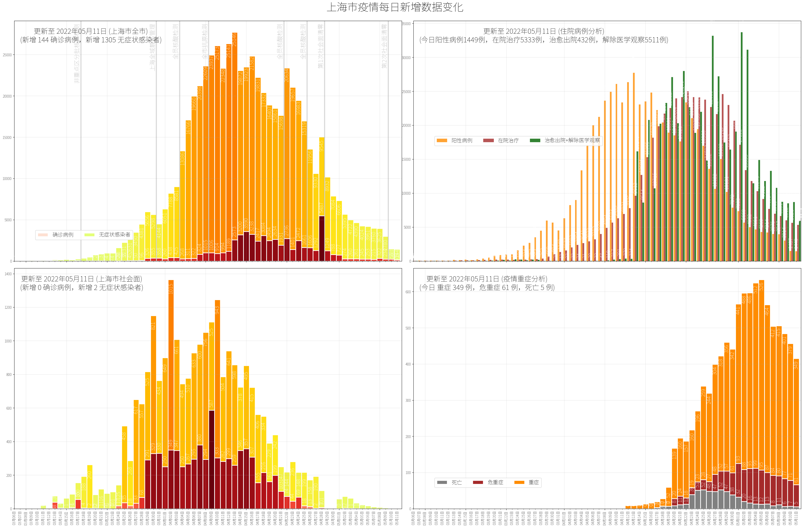
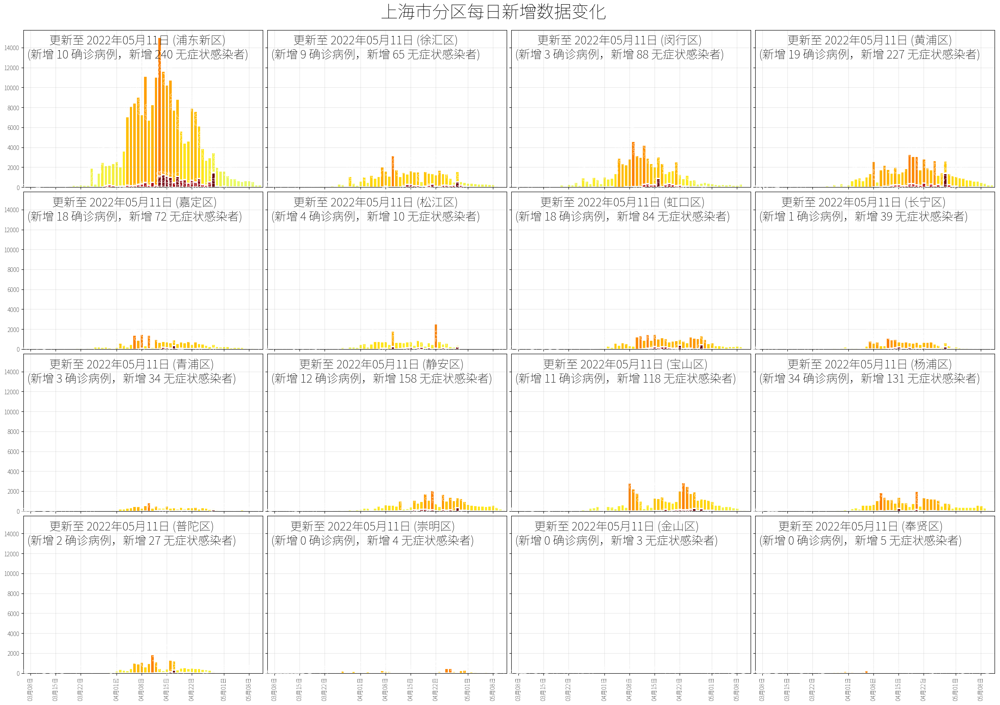
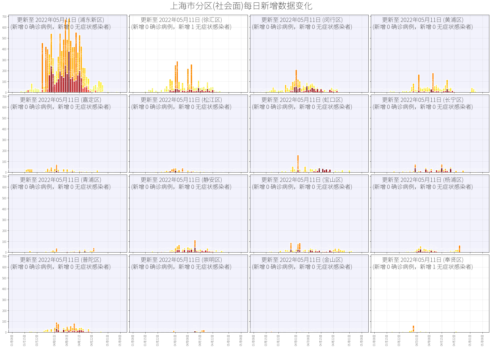
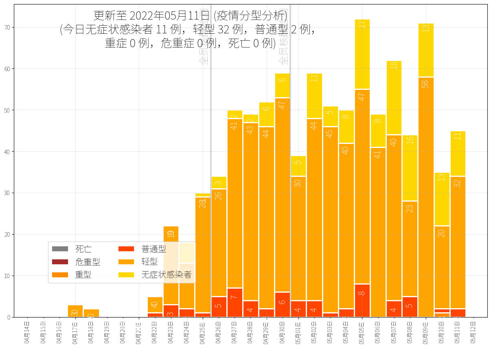
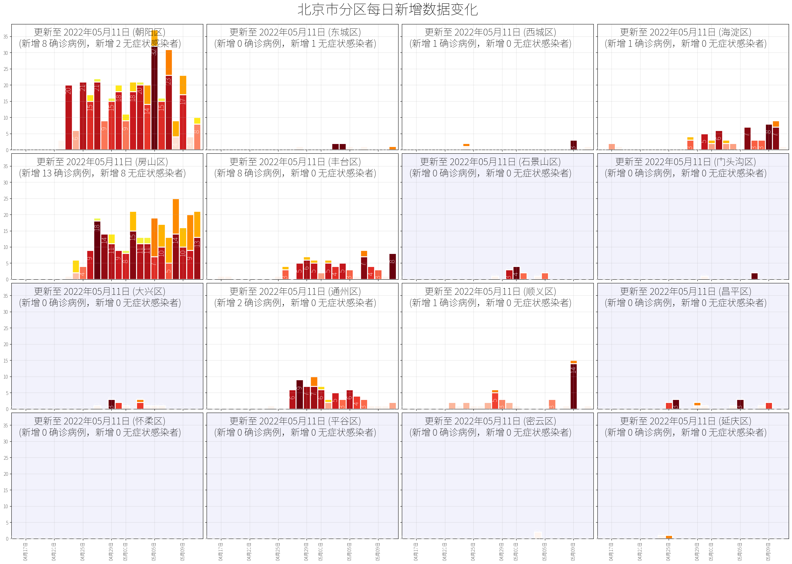
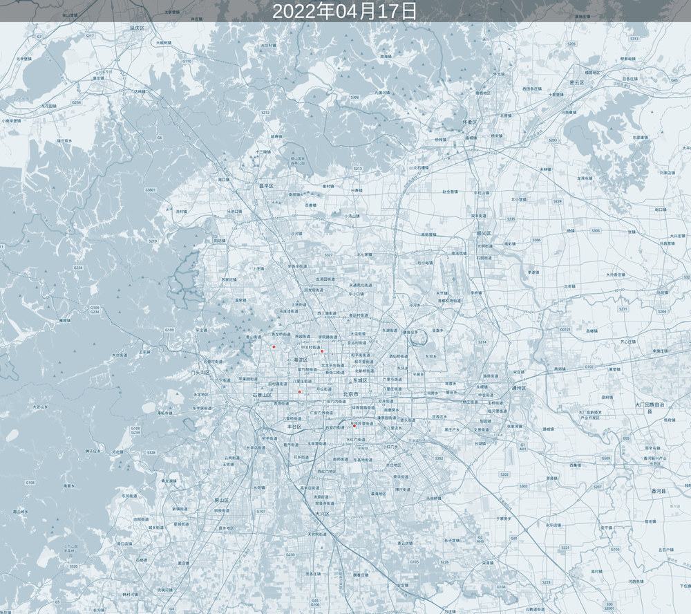

# 新冠疫情数据


## 爬虫

爬虫使用 Go 撰写，数据来源自上海卫健委官方网站 [https://wsjkw.sh.gov.cn/xwfb/index.html]，以及上海官方公众号**上海发布**。爬虫的使用可以参考 [Makefile](shanghai/crawler/Makefile)。

爬虫运行(`make run`)后，会生成 `shanghai/data` 目录，其中的 CSV 文件即为下载文件所得，包括 **上海每日统计数字**（`shanghai/data/shanghai-daily.csv` ）以及 **上海阳性感染者居住地经纬度信息**(`shanghai/data/shanghai-daily-residents.csv`)。除此以外，还会包括地理编码缓存(`.geo_cache`)和爬虫网页缓存(`.web_cache`)目录以存储缓存信息。

如需地理编码，需要在 `shanghai` 目录下放置 `.env` 环境变量文件，内置对应服务的密钥，如：

```ini
KEY_AMAP=xxx
KEY_TIANDITU=yyy
KEY_BAIDU_MAP=zzz

```

## 上海疫情数据






## 北京疫情数据




